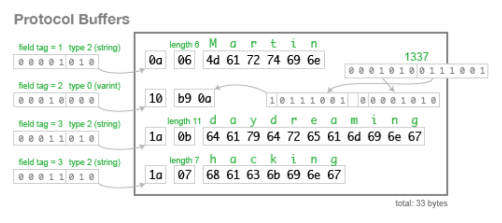

## Protocol Buffers(ProtoBuf)

---

### 1. 정의
Protocol Buffers(ProtoBuf)는 **Google이 개발한 언어-중립, 플랫폼-중립 직렬화(serialization) 라이브러리**로, 주로 gRPC와 함께 사용됩니다.
- 데이터를 **작고 빠르게 직렬화**
- 타입 안전, 구조 정의 기반
- 다양한 언어(Java, Kotlin, Go, Python 등) 지원

---

### 2. 프로토 정의 예시

```proto
syntax = "proto3";

package chat;

// 메시지 정의
message ChatMessage {
    string user = 1;
    string text = 2;
}

// 스트리밍 서비스 정의
    service ChatService {
    rpc Chat(stream ChatMessage) returns (stream ChatMessage);
}
```

- `message`: 데이터 구조 정의, 필드 번호 지정 필요
- `service`: RPC 인터페이스 정의, 스트리밍 여부(`stream`) 지정 가능

---

### 3. 데이터 직렬화 과정
1. **컴파일**
    - `.proto` 파일을 `protoc` 컴파일러로 언어별 코드 생성
    - 예: Java/Kotlin, Go, Python 등 클래스/Struct 생성
2. **직렬화(Serialization)**
    - 객체를 **바이트 배열(Byte Array)** 로 변환 → 네트워크 전송 가능
    - 직렬화된 데이터는 **작고, 빠르며, 타입 안전**
    - 
3. **역직렬화(Deserialization)**
    - 수신 측에서 바이트 배열을 **원래 객체로 복원**
    - 메시지 필드가 누락되거나 순서가 바뀌어도 호환성 유지 가능

---

### 4. 언어별 사용 방법

| 언어 | 사용 방법 | 특징 |
|------|-----------|------|
| Java/Kotlin | `protoc --java_out=...` <br> 생성된 클래스 사용, `Builder`로 객체 생성 | gRPC와 자연스럽게 연동 가능 |
| Go | `protoc --go_out=...` <br> Struct 생성, `proto.Marshal`/`proto.Unmarshal` | 고루틴과 쉽게 결합 가능 |
| Python | `protoc --python_out=...` <br> Python 클래스 사용, `SerializeToString` / `ParseFromString` | 동적 타입 지원, 쉽게 테스트 가능 |
| C++ | `protoc --cpp_out=...` <br> 객체 생성 후 Serialize/Parse 사용 | 성능 최적화, 시스템 프로그래밍에 적합 |
| JavaScript/Node.js | `protoc --js_out=...` <br> 객체 생성, `serializeBinary()` / `deserializeBinary()` | gRPC-Web과 연동 가능 |

---

### 5. 장점
- **작고 빠른 데이터 전송**: JSON 대비 바이트 크기 훨씬 작음
- **타입 안전**: 컴파일 타임에 메시지 구조 검증
- **언어/플랫폼 중립**: 다양한 언어에서 동일한 데이터 구조 사용 가능
- **버전 호환성**: 필드 추가/삭제 시 이전 버전과 호환 가능

---

### 6. 사용 포인트
- gRPC 메시지 정의에 기본적으로 사용
- 스트리밍, 반복 필드, 중첩 메시지 등 다양한 구조 지원
- 직렬화/역직렬화 과정이 자동화되어 네트워크 전송 효율 향상
