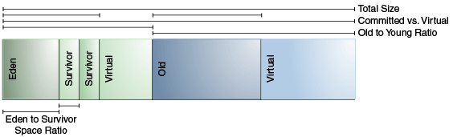

## 💬 Garbage Collection

---

### ☝️핵심 요약
1. **가비지 컬렉션(GC)**: JVM에서 메모리 관리를 자동화하는 프로세스 
   1. **minor GC**(eden -> survivor1,2 -> old) -> **major GC**(전체 heap GC)
2. **주요 알고리즘**
   1. **Serial Collector**: 단일 스레드 사용, 작은 힙 / 단일 프로세서에 적합
   2. **Parallel Collector**: 다중 스레드 사용, 최대 처리량 목표
   3. **G1 Garbage Collector**: 대부분의 작업을 애플리케이션과 동시에 수행, 높은 처리량과 예측 가능한 중단 시간 제공
   4. **Z Garbage Collector**: 최대 중단 시간을 1밀리초 미만 유지, 저지연 애플리케이션에 적합

- 출처: https://docs.oracle.com/en/java/javase/21/gctuning/introduction-garbage-collection-tuning.html
---

### 🗑️ GC 개요

**가비지 컬렉션(GC) 이란?**
- JVM에서 메모리 관리를 자동화하는 프로세스
- 대부분의 객체가 짧은 기간 동안만 사용되기 때문에, young/old 영역을 구분해 관리
- 각 영역에 virtual 공간을 두어 필요에 따라 할당 (전체 힙 공간은 jvm 초기화시, 예약)
  
- 객체 수명주기: **minor GC**(eden -> survivor1,2 -> old) -> **major GC**(전체 heap GC)
- **minor GC**: young 영역에서만 수행, 짧고 빈번
  - **eden**: 최초 생성 시, 할당되는 영역
  - **survivor1,2**: eden에서 살아남은 객체가 이동하는 영역; 하나의 영역은 항상 비어 eden + 사용중 survivor의 목적지 역할을 함 
  - **old**: 장기간 사용되는 객체가 이동하는 영역
- **major GC**: old 영역까지 포함한 전체 heap에서 수행, 길고 드물게 발생, 애플리케이션 일시 중단(Stop-the-world) 발생

**GC 성능 고려요소**

- 힙의 각 영역 크기에 따라 GC 발생 빈도가 결정되므로 적절한 힙 크기 설정이 중요
- 가비지 컬렉션 옵션
```
   -XX:MaxGCPauseMillis: 최대 GC 일시중단 시간 목표 설정 (기본값 없음)
   -XX:GCTimeRatio: GC와 애플리케이션 실행 시간 비율 설정 (기본값 99, 1% 시간 GC에 할당)
```
- 힙 사이즈 및 영역 비율
```
   -Xms: 최소 힙 크기 (기본값 물리 메모리의 1/64)
   -Xmx: 예약된 힙 크기 (기본값 물리 메모리의 1/4)
   -XX:NewRatio: young 영역 비율 (기본값 2, old:young = 2:1)
   -XX:SurvivorRatio: survivor 영역 비율 (기본값 8, eden:survivor = 8:1:1)
   -XX:NewSize: young 영역 하한 (기본값 1310MB)
   -XX:MaxNewSize: young 영역 상한 (기본값 없음)
```
- 여유 공간 비율
```
   -XX:MinHeapFreeRatio: 최소 여유 공간 비율 (기본값 40)
   -XX:MaxHeapFreeRatio: 최대 여유 공간 비율 (기본값 70)
```

---

### 🎻 주요 GC 알고리즘
- 특별한 목표가 있지 않은 이상 VM이 collector를 선택하게 두는게 좋음.

1. **Serial Collector** (일부 OS 기본값)
   1. 단일 스레드 사용, 모든 가비지 컬렉션 작업 수행
   2. 스레드 간 통신 오버헤드가 없기 때문에 상대적으로 효율
   3. 단일 프로세스 머신, 작은 힙 크기 환경에 적합
2. **Parallel Collector** (Throughput Collector)
   1. 여러 개의 스레드를 사용하여 GC를 병렬로 수행
   2. STW가 조금 길어지더라도 최대 처리량 목표
   3. 멀티 프로세스 머신, 중간 ~ 대규모 데이터 셋에 적합
3. **Garbage-First (G1) Garbage Collector** (대부분의 OS 기본값)
   1. 대부분의 작업을 애플리케이션과 동시에 수행
   2. 높은 처리량, 중단 시간(pause time) 목표를 높은 확률로 만족
   3. STW를 예측 가능하게 관리, 대부분의 애플리케이션에 적합
4. **The Z Garbage Collector**
   1. 최대 중단 시간을 1밀리초 미만 유지
   2. 최대 중단 시간을 보장하느라 전체 처리량을 희생할 수 있음
   3. 저지연 애플리케이션에 적합

- GC 선택 옵션
```
    -XX:+UseSerialGC: Serial Collector 사용
    -XX:+UseParallelGC: Parallel Collector 사용
    -XX:+UseG1GC: G1 Garbage Collector 사용
    -XX:+UseZGC: Z Garbage Collector 사용
        -XX:+ZGenerational: ZGC에서 세대별 수집 (young/old 영역의 특성 활용) 활성화
        -XX:-ZGenerational: ZGC에서 세대별 수집 비활성화
```
