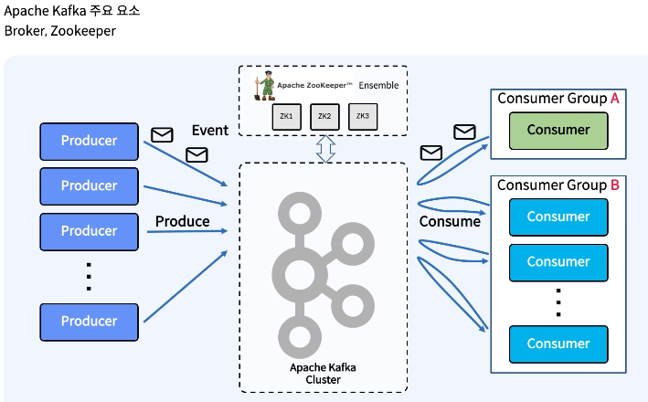

# 카프카 아키텍쳐

---



---

## Kafka Cluster
- 카프카의 논리적 서비스 단위

### 1.Broker (Bootstrap Server)
- 카프카 클러스터의 물리/논리적 서버 단위
- 이벤트 메시지를 토픽에 따라 파티션 단위로 저장/제공

[**Topic**]: 메시지 로그를 저장하는 카테고리. publish-subscribe 단위
[**Partition**]: 토픽별 메시지 로그가 저장/제공되는 단위
- 파티션 내 메시지 로그는 여러 세그먼트로 나누어 저장, 오래된 로그 삭제 또는 압축 가능
- [**Offset**]: 각 파티션 내 메시지 위치; 컨슈머가 메시지를 읽는 기준, 파티션 단위 순서 보장
  ```
      /kafka-logs/
          Orders-0/           ← 파티션 디렉토리
              00000000000000000000.log       ← 첫 번째 세그먼트
              00000000000000000001.log       ← 두 번째 세그먼트
              00000000000000000001.index     ← offset index
              00000000000000000001.timeindex ← timestamp index
  ```
[**Replication**]: 각 파티션의 복제본을 다른 브로커에 두어 데이터 내구성, 가용성 확보
- 파티션 단위로 브로커 리더/팔로워가 결정되며, 팔로워가 리더로 부터 파티션을 pull
- [**ISR(In-Sync Replicas)**]: 각 브로커에서 관리되는 이미 sync된 브로커 목록, 리더 브로커 메모리에 저장됨
```


[Broker1 (/kafka-logs/)]
Orders-0/               ← 파티션 0 (리더)
    00000000000000000000.log
    00000000000000000001.log
    00000000000000000000.index
    00000000000000000000.timeindex
    ISR: [Broker1, Broker2]  ← 리더 브로커로 관리

[Broker2 (/kafka-logs/)]
Orders-0/               ← 파티션 0 (팔로워)
    00000000000000000000.log
    00000000000000000001.log
    00000000000000000000.index
    00000000000000000000.timeindex
    ISR: [Broker1, Broker2]  ← 리더 Broker1가 관리, 단순 복제

Orders-1/               ← 파티션 1 (리더)
    00000000000000000000.log
    00000000000000000001.log
    00000000000000000000.index
    00000000000000000000.timeindex
    ISR: [Broker2, Broker3]  ← 리더 브로커로 관리

[Broker3 (/kafka-logs/)]
Orders-1/               ← 파티션 1 (팔로워)
    00000000000000000000.log
    00000000000000000001.log
    00000000000000000000.index
    00000000000000000000.timeindex
    ISR: [Broker2, Broker3]  ← 리더 Broker2가 관리, 단순 복제

```

### 2.ZooKeeper
- 카프카 클러스터의 메타데이터와 상태를 관리하고, 분산 환경에서 노드 간 조율을 제공
- 참고로 최신 Kafka(KRaft 모드)는 ZooKeeper 없이 동작 가능하며, ZooKeeper가 없는 경우 컨트롤러 브로커가 ZooKeeper 역할 수행
- 주요 역할
  1. 브로커 관리
     - 클러스터에 참여하는 브로커 등록 및 상태 모니터링
     - 브로커 장애 감지 → 클러스터 구성 재조정
  2. 토픽과 파티션 메타데이터 관리
     - 토픽 생성/삭제, 파티션 개수, 복제 팩터 등 정보 저장
     - 어떤 브로커가 특정 파티션을 리더/팔로워로 담당하는지 정보 제공
  3. 리더 선출(Leader Election)
      - 파티션 리더 브로커 장애 발생 시, ISR 내 팔로워 중 새 리더 선출
      - 클러스터 전체 일관성 유지
  4. 클러스터 상태 관리
      - 브로커 상태, 토픽/파티션 배치 등의 메타데이터 제공
      - 클러스터 확장/축소 시 일관된 정보 제공
  5. 분산 조율(Distributed Coordination)
      - 여러 브로커 간 동기화 및 조율 지원
      - Kafka 외 다른 분산 시스템에서도 활용 가능

---

## Producer/Consumer

---

### Producer
- 카프카 클러스터로 데이터를 전송하는 주체

- 주요역할
  1. 메시지 생성 및 전송
     - 어플리케이션에서 생성한 데이터를 카프카 토픽에 기록
     - 메시지는 항상 파티션 리더 브로커로 전송
     - [**Record(essage)**]: 프로듀서가 전송하는 데이터 메시지 기본 단위
       - Key: 파티션 선택에 사용 가능
       - Value: 실제 전송할 데이터
       - Timestamp: 메시지 생성 시간
     - [**Batch**]: 메시지를 묶어 전송
       - 네트워크 효율 향상
       - `linger.ms`, `batch.size` 설정으로 배치 전략 조정
  2. 메시지 토픽, 파티션 결정
     - 파티션 선택
       - Key 기반 파티셔닝: 같은 Key는 항상 같은 파티션에 저장 → 메시지 순서 보장
       - 라운드 로빈 파티셔닝: Key가 없는 경우, 파티션에 균등하게 분배
       - 사용자 지정 파티셔너: 필요에 따라 커스텀 로직으로 파티션 선택 가능
  3. 데이터 신뢰성 관리
     - [**ACK 정책**]
       - 0: Producer는 ACK를 기다리지 않고 전송 후 바로 반환
       - 1(default): 파티션 리더 브로커에 기록되면 ACK 반환
       - all/-1: ISR 내 모든 브로커에 복제 완료 후 ACK 반환
     - [**Retry 정책**]
       - **retries**: 전송 실패 시, 지정 횟수만큼 자동 재시도 (retries=<숫자>)
         - 중복 메시지 발생 가능성
         - 메시지 순서 변경 가능성
           ```
             [max.in.flight.requests.per.connection=5]
           
             1. producer가 메시지 5개 전송
                - 전송 순서: A → B → C → D → E
             2. 메시지 B 전송 실패 발생 → 재전송 시도
             3. Producer는 이미 연결에서 C, D, E 요청을 브로커에 보냄
             4. 브로커는 도착 순서대로 처리
                - 브로커 저장 순서: A → C → D → E → B(재전송)

             * 방지
               - max.in.flight.requests.per.connection=1: 한번에 하나만 전송
               - enable.idempotence=true: 멱등성 처리
           ```
       - **Idempotence(멱등성)**: producer가 메시지를 중복 전송해도 브로커에서 단일 메시지로 처리 (enable.idempotence=true)
         - 중복 메시지 방지 → 메시지 처리 정확성 보장
         - 메타데이터 추가로 성능 오버헤드
       - **Transactional**: 여러 메시지를 한 트랜잭션 단위로 전송 (transactional.id=<고유ID>, enable.idempotence=true 필요)
         - 여러 메시지를 한 트랜잭션 단위로 묶어 전송, 커밋(commit)되면 모두 적용, 실패 시 모두 롤백 → exactly-once semantics (EOS)
         - 여러 토픽, 여러 파티션에 걸친 메시지 전송도 원자적 처리
         - 중복 또는 누락 없이 정확히 한 번 처리
         - 트랜잭션 처리 성능 저하 발생 
         - 트랜잭션 종료 전에 브로커/Producer 장애 시, 트랜잭션 복구 필요

---

### Consumer
- 카프카 클러스터에서 메시지를 읽는 주체

- 주요 역할
    1. 메시지 구독
        - 특정 토픽을 구독(subscribe)하여 메시지 스트림을 읽음
        - Consumer는 `poll()` 호출을 통해 메시지를 가져옴
        - 장기 블로킹 없이 주기적으로 poll 호출 → 브로커와 세션 유지
        - `max.poll.records`, `max.poll.interval.ms` 등 설정으로 처리량/세션 관리 가능
        - [**Consumer Group**]: 여러 Consumer가 하나의 그룹으로 묶여 메시지를 분산 처리
            - 하나의 파티션은 동일한 Consumer Group 내에서 **한 Consumer만 처리**
            - 그룹 내 Consumer 수 < 파티션 수: 일부 Consumer가 여러 파티션 처리
            - 그룹 내 Consumer 수 > 파티션 수: 일부 Consumer는 할당된 파티션 없음
            - ZooKeeper에서 그룹ID, Consumer 멤버, 파티션 할당 정보 저장
    2. 데이터 신뢰성 관리
        - [**Offset 관리**]: Consumer가 메시지 처리 후 커밋(commit) → 재시작 시 해당 offset부터 재개
          - Kafka 내부 토픽(__consumer_offsets)에 저장
          - 자동 커밋: 일정 간격으로 Kafka에 offset 기록
          - 수동 커밋: 애플리케이션 처리 완료 후 commit
        - [**Retry**]
          - 메시지 처리 실패 시, 재시도 횟수 제한과 backoff 전략 필요; 무한 재시도는 시스템 부하 유발 가능
          - 처리 불가 메시지를 별도 토픽에 저장; Dead Letter Queue(DLQ)
            - 이후 DLQ 토픽을 별도 Consumer가 처리하여 문제 해결
          - (isolation.level=read_committed) 옵션을 통해 프로듀서를 통해 EOS가 보장된 메시지만 읽을 수 있음.
        - [**Rebalance 처리**]
          - Consumer Group 내 Consumer가 추가/제거되면 파티션 재할당 발생
          - 리밸런싱 과정
            ```
                1. 트리거
                    - Consumer가 그룹에 새로 가입/탈퇴
                    - 파티션 수 변경
                    - Consumer heartbeat 실패 → ZooKeeper가 장애 감지
                2. Coordinator
                    - ZooKeeper가 Consumer Group 내 **리더 Consumer**를 선택
                    - 선택된 리더 Consumer가 Rebalance 계획 수행
                3. 파티션 재할당
                    - 리더 Consumer가 그룹 멤버와 파티션 목록 확인
                    - 할당 전략(partition assignment strategy)에 따라 재할당
                        - 기본 RangeAssignor 사용
                    - 재할당 결과를 ZooKeeper에 기록
                4. Consumer 적용
                    - 브로커와 각 Consumer가 ZooKeeper에서 새 파티션 할당 정보 확인
            ```
          - rebalancing이 발생한 시점에 처리된 메시지 offset을 commit하지 않았다면, 새로 할당된 컨슈머에서 재처리 가능