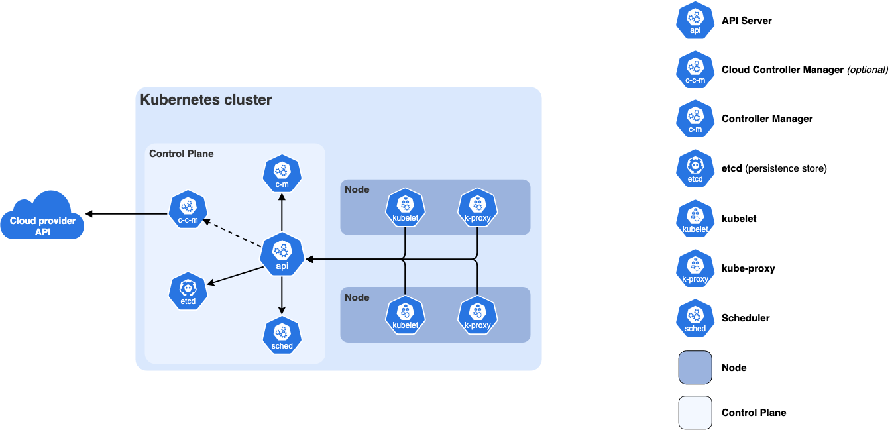
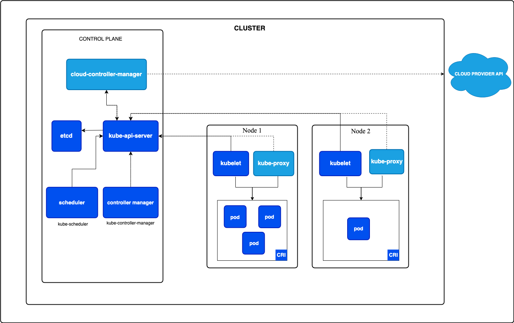

## 쿠버네티스 클러스터 컴포넌트

---

---
### 컨트롤 플레인 컴포넌트

- control-plane component:  클러스터에 대한 전역적인 결정(예를 들어, 스케줄링)뿐만 아니라, 클러스터의 이벤트를 감지하고 대응한다.
    - kube-apiserver: 쿠버네티스를 컨트롤 가능하게 하는 endpoint
    - etcd: 모든 클러스터 데이터를 담는 키-값 저장소
    - kube-scheduler: 파드를 실행할 노드 선택
    - kube-controller-manager: 컨트롤러 프로세스 실행
      - controller: 쿠버네티스의 현재 상태를 원하는 상태와 비교하여 조정
      - 예시
        - node controller: 노드 다운 감지 및 대응
        - job controller: 잡 오브젝트 관리 및 파드 생성
        - deployment controller: 파드가 특정 개수 유지하도록 관리
        - service account controller: 네임스페이스에 서비스 어카운트 관리
  - 각 구성요소는 클러스터 내부에 독립적으로 존재(노드가 다를 수 있음)하며, 고가용성을 위해 중복 존재 가능
    - 중복 존재 시, 각 컴포넌트 별 동작 차이 존재(리더 선출, 합의/동기화, 로드밸런싱 등으로 처리)
---
### 노드 컴포넌트
- node component: 각 노드에 존재하는 컴포넌트, 쿠버네티스 런타임 환경 제공
  - kubelet: 파드 및 파드 내부 컨테이너가 실행중임을 보장
    - liveness probe: 컨테이너가 살아있는지 보장, 실패시 컨테이너 재시작
    - readiness probe: 요청 처리 상태 보장, 실패시 서비스 엔드포인트에서 제외
    - startup probe: 컨테이너가 시작되는 과정을 보장
  - kube-proxy: 각 노드의 네트워크 프록시 (서비스 개념의 구현)
    - 노드의 네트워크 규칙 관리, 내부 네트워크/클러스터 외부 > 파드로 네트워크 통신 관리 (iptable)
  - container runtime(CRI): 노드 내 컨테이너를 실행하기 위한 의존성 집합 (ex. docker)
--- 
### 애드온
- addon: 쿠버네티스 리소스(daemonSet, Deployment 등)를 사용하여 클러스터의 기능 구현
  - kube-system 네임스페이스에 존재 
  - DNS: 클러스터 DNS 쿠버네티스 서비스에 대한 DNS 레코드를 제공하는 DNS 서버
  - 웹 UI, 컨테이너 리소스 모니터링, 클러스터 로깅 등
---
### 쿠버네티스 오브젝트
**[워크로드 오브젝트]**
- pod: 하나 이상의 컨테이너를 그룹화한 최소 실행 단위, 컨테이너끼리 네트워크/볼륨 공유
- replica set: 파드의 개수와 버전 유지
- deployment: 파드와 레플리카셋을 관리
  - 업데이트 전략 관리 (rolling update 등)
  - 롤백 지원 (이전 레플리카셋으로 변경 등)
  - 스케일 아웃 관리
- stateful set: 동일한 기능에 대해 각기 다른 고유 상태를 갖는 파드 관리
  - 각 파드에 안정적인 DNS 이름, 고유 PV 등 제공 
  - 예시: DB, kafka, redis cluster 등
- daemon set: 클러스터 단위 파드 배포
  - 예시: 노드 로그 수집, 모니터링, 네트워크 플러그인
- job, cronjob: 배치성 기능의 단건/주기적 작업

**[서비스 오브젝트]**
- service: 파드 집합에 대해 안정적인 접근 제공 (ip, dns), 클러스터 내/외부 통신
- ingress: http/https 트래픽 라우팅 규칙 정의 오브젝트
  - ingress controller: 인그레스 오브젝트에 의해 정의된 라우팅 규칙을 실제 적용하는 서비스
    - 쿠버네티스 클러스터 내에 서비스 형태로 관리되며, 해당 서비스를 외부로 드러내 접근
      - service type: loadbalancer, node port 등
    - 예시) nginx 등
- Network policy: pod 간 네트워크 통신 허용/차단 규칙 정의

**[구성 오브젝트]**
- config map: 비밀이 아닌 데이터 key-value 저장, pod에 환경변수/볼륨으로 주입
  - cli 등을 통해 api 서버를 통해 주입, etcd 내에 저장
- secret: 비밀번호 등 민감데이터 저장, base64인코딩으로 pod에 주입
  - cli 등을 통해 api 서버를 통해 주입, etcd 내에 저장
  - 기본적으로 base64로 인코딩 되기 때문에 별도 암호화 필요
- persistent volume(pv): 외부 스토리지(db 등)를 pod가 사용하도록 추상화
  - 클러스터 내부에 NFS 구성 후 접근 / 외부 DB서버 접근 등 자유롭게 구성 
- persistent volume claim(pvc): pod가 필요로 하는 스토리지 요구사항 요청
  - pod가 pv가 아닌 pvc를 통해 실제 pv를 모르고 사용하도록 추상화
  - 활용: 여러 pv에 동적으로 접근 등

---
### 노드, 파드, 컨테이너
- node: 물리(가상) 머신
- pod: 노드 내 논리 단위(컨테이너 그룹, 가상 공간), 네트워크/볼륨 공유
    - cri를 docker라고 생각하면 네트워크 네임스페이스, ip, 볼륨 마운트 등을 공유
- container: 실제 어플리케이션 이미지 단위
---