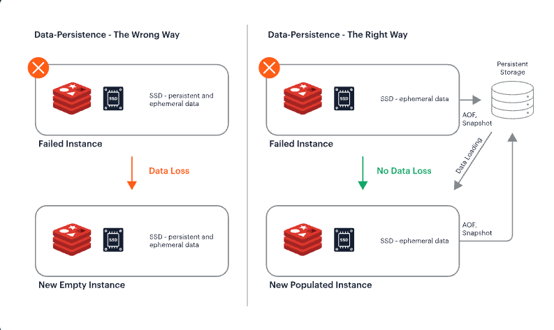

## Redis

---

### 1. 정의
Redis는 **오픈 소스 인메모리 데이터 구조 저장소**로, 주로 **캐시(Cache), 메시지 브로커(Message Broker), 실시간 데이터 처리** 등에 사용됩니다.
- **In-Memory 저장소**: 데이터를 메모리에 저장하여 매우 빠른 읽기/쓰기 속도를 제공
- **Key-Value 기반**: 문자열, 리스트, 셋, 해시, 정렬된 셋 등 다양한 데이터 구조를 지원
- **Persistence 옵션**: 메모리 기반이지만 디스크에 데이터를 저장하여 복구 가능
- **주요 사용 사례**: 캐시, 세션 관리, 랭킹 시스템, 실시간 통계, 메시지 큐

---

## 2. 구조

### 2.1 아키텍처
1. **싱글 스레드 이벤트 루프**: 모든 클라이언트 요청을 단일 스레드에서 처리
    - I/O 멀티플렉싱을 통해 많은 연결을 효율적으로 처리
      - [**IO Multiplexing**]
        - 하나의 프로세스/스레드가 여러 I/O 자원을 단일 스레드로 동시에 감시하고 처리하는 기술. 
        ``` 
        1. 필요성
          - 블로킹 I/O: 소켓마다 스레드 필요 → 비용 증가
          - I/O Multiplexing: 단일 스레드로 다수 소켓 처리 가능
        2. 동작 방식
          a. 감시 대상 등록 (`select`, `poll`, `epoll`)
          b. 이벤트 발생 대기
          c. 이벤트 발생 시 읽기/쓰기 처리
          d. 반복
        ```
    - 싱글 스레드라 각 요청의 순서를 보장하며, 원자적으로 처리
      - [**Lua script**]
        - 단일 명령으로 처리해야 하는 원자적(Atomic) 로직 정의
        - Redis 서버 내부에서 실행되므로 네트워크 왕복 감소
- **메모리 기반 데이터 처리**: 모든 데이터가 RAM에 저장되므로 접근 속도가 매우 빠름
- **Persistence 방식**
  - 
    - **AOF(Append Only File)**: 모든 쓰기 명령을 로그로 기록, 복구 시 재생
    - **RDB(Redis Database File)**: 주기적 스냅샷 저장

### 2.2 주요 데이터 구조
| 데이터 타입 | 설명 | 사용 예시 |
|------------|------|-----------|
| String | 일반 문자열, 숫자 등 | 캐시 값, 카운터 |
| List | 순서가 있는 리스트 | 메시지 큐, 최근 기록 |
| Set | 중복 없는 집합 | 태그, 좋아요 |
| Sorted Set | 점수 기반 정렬 집합 | 랭킹, Leaderboard |
| Hash | 키-값 맵 구조 | 객체 저장, 사용자 세션 |
| Bitmap / HyperLogLog / Geo | 특수 자료 구조 | 방문자 카운팅, 위치 기반 서비스 |

### 2.3 확장
- Redis Sentinel: 레디스 노드를 하나 더 복제하여 유지, 장애 시 전환
- Redis Cluster: 데이터 샤딩과 함께 마스터-슬레이브 구조로 고가용성 제공
- Redis Module: 데이터 구조 확장
  - RediSearch: 전문 검색(Full-text search)
  - RedisJSON: JSON 문서 저장·쿼리 
  - RedisGraph: 그래프 DB 기능 
  - RedisBloom: Bloom Filter 등 확률적 자료구조
- Redis Streams: 메시지, 로그, 이벤트 등을 순차적으로 저장하고 여러 소비자가 처리

---

## 3. Redis의 장단점 및 활용

### 3.1 장점
- **속도**: 메모리 기반이므로 읽기/쓰기 속도가 매우 빠름
- **원자성**: 싱글 스레드 기반으로 작업 순서 보장
- **다양한 데이터 구조**: 단순 Key-Value 외에도 복잡한 데이터 구조 지원 

### 3.2 단점
- **메모리 기반 한계**: RAM 용량만큼 데이터 저장 가능, 비용 증가 가능
- **단일 스레드**: CPU 바운드 작업에는 제한적
- **복잡한 영속성 관리**: AOF, RDB 설정과 데이터 손실 가능성 고려 필요

### 3.3 활용
- **캐시(Cache)**: DB 부하 감소 및 응답 속도 향상
- **세션 관리(Session Store)**: 웹 애플리케이션 세션 저장
- **실시간 분석/통계**: 방문자 수, 클릭 수, 게임 점수판 등
- **메시지 브로커(Pub/Sub)**: 채팅, 알림, 이벤트 처리


