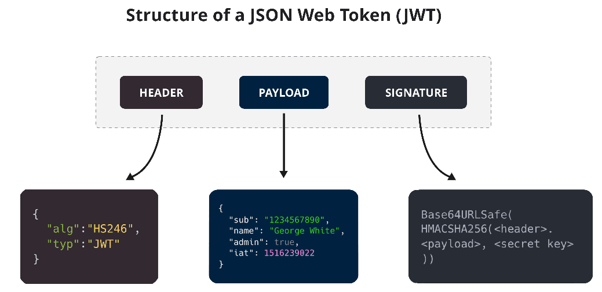

## JWT (JSON Web Token)

---



---

### 1. 정의
JWT는 **JSON 기반의 URL-safe 토큰 표준**으로, **사용자 인증(Authentication)과 권한 부여(Authorization)** 정보를 안전하게 전달할 때 사용
- **Self-contained 토큰**: 사용자 정보와 권한 정보를 토큰 자체에 포함
- **서명(Signature)**: HMAC 또는 RSA/ECDSA를 이용하여 변조 방지
- **URL-safe**: Base64Url로 인코딩되어 HTTP 헤더, URL 등에서 안전하게 전달 가능
- **주요 사용 사례**: 인증 토큰, API 접근 제어, 마이크로서비스 간 인증

---

## 2. 구조

### 2.1 구성
1. **Header (헤더)**
    - 토큰 타입(JWT)과 서명 알고리즘(예: HS256, RS256) 정의
    ```json
    {
      "alg": "HS256",
      "typ": "JWT"
    }
    ```
2. **Payload (페이로드)**
    - 사용자 정보, 권한 정보, 만료 시간 등 클레임(Claims) 포함
    ```json
    {
      "sub": "1234567890",
      "name": "John Doe",
      "iat": 1516239022,
      "exp": 1516242622
    }
    ```
3. **Signature (서명)**
    - Header와 Payload를 합쳐 비밀 키 또는 공개/개인키로 서명
    - 변조 여부 검증 가능
    ```
    HMACSHA256(
      base64UrlEncode(header) + "." +
      base64UrlEncode(payload),
      secret
    )
    ```

> 최종 JWT: `Header.Payload.Signature` (각각 Base64Url 인코딩, 점(.)으로 구분)

### 2.2 전달 및 사용
- **HTTP Header**: `Authorization: Bearer <token>` 방식으로 주로 사용
- **쿠키(Cookie)**: 웹 클라이언트 인증용으로도 활용 가능
- **장점**
    - 토큰 자체에 정보 포함 → 서버 상태를 유지할 필요 없음 (Stateless)
    - 다양한 서비스 간 인증 및 권한 정보 공유 용이

---

## 3. 장단점 및 활용

### 3.1 장점
- **Stateless**: 서버에서 세션 상태를 관리하지 않아 확장성 높음
- **보안성**: 서명(Signature)으로 데이터 변조 방지
- **범용성**: 웹, 모바일, API, 마이크로서비스 등 다양한 환경에서 사용 가능

### 3.2 단점
- **토큰 만료까지 정보 유효**: 만료 전에는 취소 불가 (Revocation 어려움)
- **Payload 노출 가능**: 서명으로 변조는 막지만, 암호화하지 않으면 내용 평문 노출
- **토큰 크기 증가**: Header + Payload + Signature → HTTP 요청 시 Overhead 발생

### 3.3 활용
- **인증 토큰**: 로그인 후 Access Token으로 사용
- **권한 부여**: Role, Scope 정보 포함하여 API 접근 제어
- **마이크로서비스 인증**: 서비스 간 토큰 검증으로 권한 위임
- **Single Sign-On (SSO)**: 여러 서비스에서 동일 토큰으로 인증 처리
