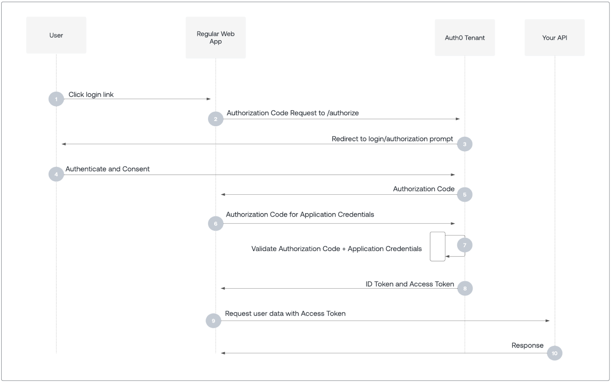

## OAuth

---

---

### 1. 정의
OAuth는 **사용자의 비밀번호를 제3자 애플리케이션에 제공하지 않고**, 사용자가 허용한 범위 내에서 **자원(Resource)에 접근 권한을 위임**할 수 있게 해주는 **인증·권한 위임 프로토콜**입니다.
- **권한 위임(Authorization)**: 사용자 대신 클라이언트 애플리케이션이 자원 서버에 접근 가능
- **Access Token 기반**: 토큰을 통해 접근 권한을 제어
- **인증(Authentication)과 권한 부여 분리**: 단순 로그인과 권한 제어를 분리
- **주요 사용 사례**: 소셜 로그인, 외부 API 연동, 마이크로서비스 간 권한 위임

---

## 2. 구조

### 2.1 역할(Role)
| 역할 | 설명 |
|------|------|
| Resource Owner (자원 소유자) | 자원 접근 권한을 가진 사용자 |
| Client (클라이언트 애플리케이션) | 사용자를 대신해 자원 접근 요청 |
| Authorization Server (인가 서버) | 토큰 발급 및 권한 검증 |
| Resource Server (자원 서버) | 실제 자원(API, 데이터)을 제공 |

> Authorization Server와 Resource Server는 물리적으로 같을 수도, 분리될 수도 있습니다.

### 2.2 일반적인 흐름 (Authorization Code Grant 기준)
1. **권한 요청**: Client가 Resource Owner를 Authorization Server 인증 페이지로 리다이렉트
    - 전달 정보: Client ID, 요청 권한(scope), 리다이렉션 URI 등
2. **사용자 인증 및 승인**: Resource Owner가 로그인 후 권한 허용
3. **Authorization Code 발급**: Authorization Server가 Client의 리다이렉션 URI로 코드 반환
4. **Access Token 발급**: Client가 Authorization Code를 제출하고 Access Token/Refresh Token 발급
5. **자원 접근**: Client가 Access Token을 이용해 Resource Server 요청
    - Resource Server는 토큰 검증 후 허용된 자원만 응답

### 2.3 Grant Type
- **Authorization Code**: 서버 기반 앱에서 안전하게 사용
- **Implicit**: 브라우저 기반 앱에서 빠른 접근용 (보안 취약 가능성 있음)
- **Client Credentials**: 서버 간 통신용, 사용자 참여 없음
- **Resource Owner Password Credentials**: 신뢰된 클라이언트에서만 사용

---

## 3. 특징 및 장단점

### 3.1 장점
- **보안 강화**: 사용자 비밀번호를 직접 전달하지 않아 안전
- **권한 범위 제어**: Scope, 토큰 만료, Refresh Token 지원
- **표준화**: 다양한 서비스와 호환 가능, 마이크로서비스 및 API 관리 용이

### 3.2 단점
- **구현 복잡성**: Authorization Server, Token 관리 등 설정 필요
- **토큰 관리 주의**: 탈취 시 권한 남용 가능
- **인증(identity) 기능 제한**: OAuth 자체는 사용자 인증보다는 권한 위임 중심

### 3.3 활용
- **소셜 로그인**: Google, Facebook, Kakao 로그인 연동
- **API 접근 제어**: 외부 서비스가 제한된 자원만 접근하도록 권한 위임
- **마이크로서비스 인증/인가**: 서비스 간 안전한 토큰 기반 통신
