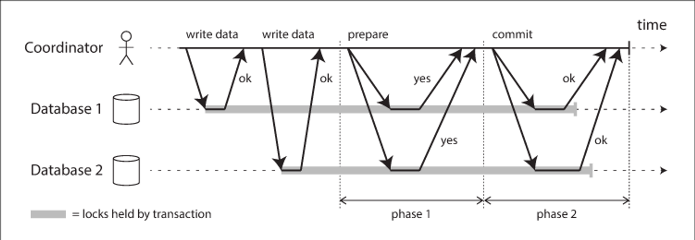

## 2PC (Two-Phase Commit) 패턴

---



---

### 1. 정의
2PC(Two-Phase Commit)는 **분산 트랜잭션을 원자적으로(commit/rollback) 처리하기 위한 프로토콜**입니다.
- 여러 서비스 또는 DB 인스턴스가 참여하는 트랜잭션에서 **모든 참여자가 성공해야 전체 트랜잭션이 커밋**
- 어느 하나라도 실패하면 **전체 롤백**
- 사용 환경: 분산 DB, 마이크로서비스, 금융 시스템 등

---

### 2. 동작 방식

#### 2.1 참여자 및 조정자
- **Coordinator(조정자)**: 트랜잭션 진행 관리
- **Participant(참여자)**: 실제 로컬 트랜잭션 실행

#### 2.2 두 단계 프로토콜
1. **Prepare 단계 (Phase 1)**
    - Coordinator가 참여자들에게 **트랜잭션 준비 준비 완료 요청(pre-commit)** 전송
    - 참여자는 **로컬 트랜잭션 수행 후 성공/실패 여부를 Coordinator에 응답**
2. **Commit 단계 (Phase 2)**
    - 모든 참여자가 성공을 응답하면 Coordinator가 **Commit 명령** 전송
    - 하나라도 실패하면 **Rollback 명령** 전송
    - 참여자는 Coordinator의 지시에 따라 로컬 트랜잭션을 Commit 또는 Rollback

```text
    Phase 1: PREPARE → YES/NO 응답
    Phase 2: COMMIT or ROLLBACK
```

---

### 3. 장점
- **원자성(Atomicity) 보장**: 모든 참여자가 동시에 커밋되거나 롤백
- 단일 트랜잭션으로 **분산 데이터 일관성** 확보 가능
- 금융, 결제 등 정합성 필수 시스템에 적합

---

### 4. 단점 / 한계
- **블로킹(Blocked)** 문제: Coordinator나 참여자가 실패 시 전체 트랜잭션 대기
- **성능 부담**: Prepare 단계와 Commit 단계로 메시지/네트워크 오버헤드 증가
- **단일 장애점**: Coordinator 장애 시 복구 필요
- **마이크로서비스 환경에서는 확장성 제한** → Saga 패턴이 대안으로 사용되기도 함

---

### 5. 요약
2PC는 **분산 환경에서 강력한 트랜잭션 일관성**을 보장하는 전통적 프로토콜.
- 모든 참여자가 커밋 동의 → 전체 커밋
- 하나라도 실패 → 전체 롤백
- 안정성은 높지만 성능/확장성 부담 존재
