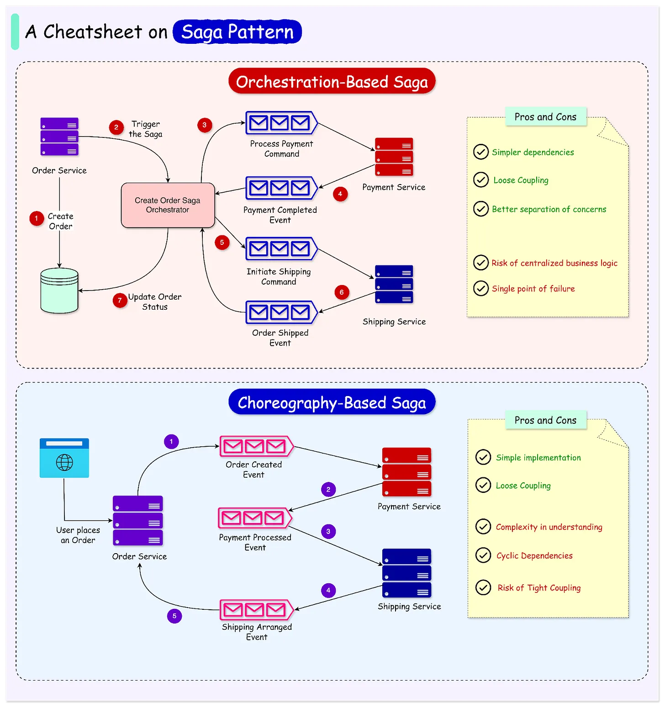

## Saga 패턴

---



---

### 1. 정의
Saga 패턴은 **SAGA(“Sequence of ACID Global Actions”)의 약자**로, **분산 시스템에서 트랜잭션을 관리하기 위한 패턴**입니다.
- 마이크로서비스 환경에서 **데이터 일관성 보장**
- 큰 트랜잭션을 여러 **작은 로컬 트랜잭션**으로 분할
- 각 트랜잭션 완료 시 **다음 트랜잭션 실행**, 실패 시 **보상 트랜잭션(Compensation Transaction)** 수행
- 사용처: 주문-결제-배송, 예약 시스템, 정산 시스템 등

---

### 2. 동작 방식

#### 2.1 이벤트 기반(Event-Driven) Saga
1. 서비스 A가 트랜잭션 완료 후 **이벤트 발행**
2. 이벤트를 구독한 서비스 B가 다음 로컬 트랜잭션 수행
3. 실패 시 **보상 이벤트** 발행 → 이전 서비스 롤백 수행

```text
주문 생성 → 결제 승인 → 재고 감소
          ↑ 실패 시 ↓
      결제 취소 → 주문 취소
```

#### 2.2 명령 기반(Orchestration) Saga
- 중앙 **오케스트레이터**가 각 서비스에 **명령(Command) 전송**
- 트랜잭션 순서, 성공/실패 상태를 오케스트레이터가 관리
- 서비스는 단순히 로컬 트랜잭션 실행 및 상태 보고

```text
오케스트레이터:
    1. 주문 생성
    2. 결제 승인
    3. 재고 감소
    → 실패 시 보상 트랜잭션 호출
```

---

### 3. 장점
- 마이크로서비스 환경에서 **데이터 일관성 유지** 가능
- 단일 서비스 장애에도 전체 시스템 영향을 최소화
- 중앙 트랜잭션 관리가 필요 없어 **서비스 독립성** 보장

---

### 4. 단점 / 고려사항
- 이벤트 기반: 이벤트 순서, 중복 처리, 메시지 보장 필요
- 명령 기반: 오케스트레이터가 단일 장애점이 될 수 있음
- 트랜잭션 롤백보다 **보상 트랜잭션 설계가 복잡**할 수 있음
- 최종적으로 **최종적 일관성(Eventual Consistency)** 보장
